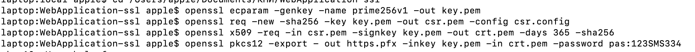
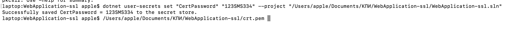
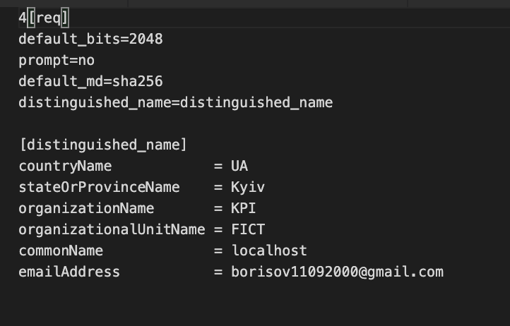
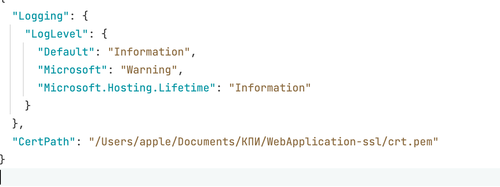
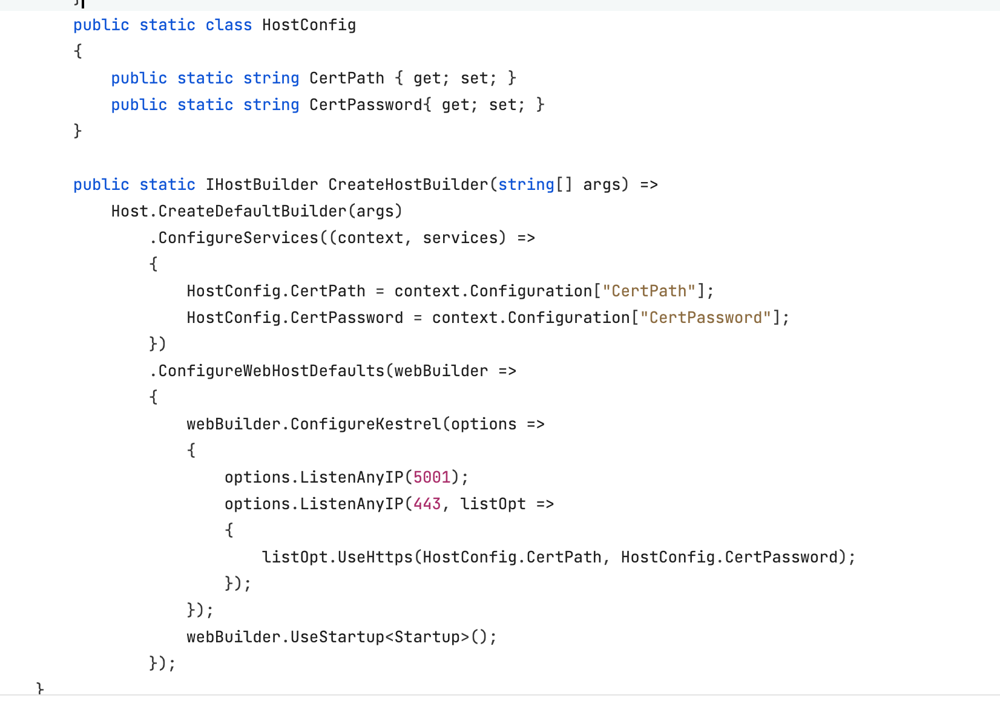
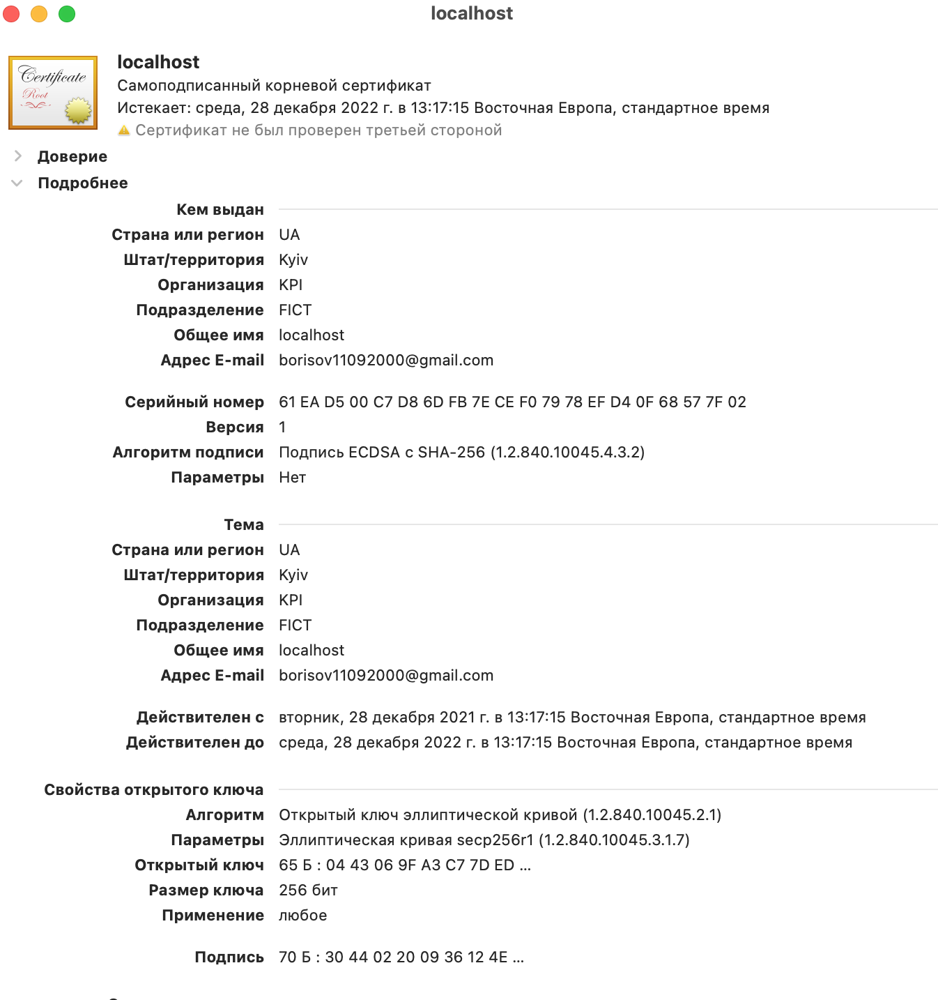

# lab 7 report

## Task 1 
<!-- In this task, we generated 100,000 passwords according to the specified characteristics. A set of 100,000 passwords consists of 70 percent of the "top 100,000 passwords" list, 10 percent of the "top 100 popular passwords" list, as well as 10 percent of completely random passwords, and the rest are plausible human passwords.

The next step was to choose two hashing schemes proposed in the task. The first is MD5 and the second is sha-1 + salt. -->

Openssl was used to generate the certificate, as shown below
To add this certificate to an ASP.NET application you need to generate a private key and a .pfx certificate file. The corresponding command is given below

<!--  -->

The .net secret store was used to save the password that the server must specify when using the .pfx file. The command is given below

<!--  -->

The following file was used as the configuration file

<!--  -->

The path to the certificate was recorded in appsetting.Development.json

<!--  -->
The following is the code that retrieves the certificate path and password from the configurations and starts the server.

We see the certificate in MacOS Keychain

## Recomendations 
The certificate can be stored next to the application code as it is public information, but we need to store the private key elsewhere. A good option is to use Azure or AWS or GCP service to save keys in the production and space on the local machine with limited access rights for development mode
. Although the .pfx file is password protected, but because it contains a private key inside, it should still be placed in places with limited access rights at the operating system level.